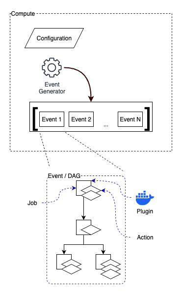

# CloudCompute for Dummies

So if "Cloud" means ["someone elses computer"](https://blog.codinghorror.com/the-cloud-is-just-someone-elses-computer/), what about "Compute"?

In this context, compute can be any computational work that can be encapsulated into a containerized runtime, and given a set of pre-defined inputs, may do work, and produce outputs. Let's break that down:

- Containerization - CC is designed to leverage Docker compatible [containers](https://www.docker.com/resources/what-container/). A wide variety of programming languages, runtimes, and operating systems are available in containerized form. These containers can be used to run software, in CC we call this software a "Plugin". See CloudCompute definitions below for more information on "Plugin" specifics, but for now, know that we encapsulate software using containers. This software is designed to run without human intervention, given a set of inputs, it will generate a set of outputs, and those can take a few different forms.

- Inputs - Information needed for the containerized software to run. Inputs can be defined in a number of ways including:

  - Environment Variables - information embedded in to the container at run-time.
  - Files - information gathered from files stored in S3 or other accessible storage, generally accessed as one of the first steps in running the software.
  - Database Records - information stored in a relational or document database accessed by the software.

- Outputs - Information generated by the software, generally as a result of running a computational process on the inputs. Outputs can be persisted in a few ways:

  - Files - information written to files on S3 or other accessible storage.
  - Database Records - information written to relational or document databases the software may have access to.

These definitions may seem quite broad, and that is by design, CC is designed to provide a wide variety of flexibility in order to accommodate many different workflows. CC provides the ability to scale those workflows both vertically (depending on the compute environment defined - see below) and most importantly, horizontally, across many more compute resources than typically available to users.

## Compute Environments

In order to use CC, we must first set up a compute environment. The compute environment defines all the resources available to CC. At the most basic level, in order to support CC, a compute environment must have 3 things:

- An Object Store - modeled after conventions pioneered by AWS S3, object stores provide standards based file storage environments. Examples include [AWS S3](https://aws.amazon.com/s3/), [Minio](https://www.min.io/), [Azure Blob Storage](https://azure.microsoft.com/en-us/products/storage/blobs/) among many others.
- A Container Run-time - a system capable of pulling and running containers, for example [AWS Batch](https://aws.amazon.com/batch/).
- An orchestration layer for defining relationships between containers to be run and their configuration.

As currently implemented in CC there are 2 main ways to set up a compute environment:

- [Local Docker](./02_setting-up-local-docker.md)

  - Minio for object storage
  - Docker desktop or dockerd for container run-time
  - Local CloudCompute for orchestration

- [Cloud (Amazon Web Services)](./03_setting-up-aws.md)

  - S3 for object storage
  - AWS Batch for container run-time and orchestration

## Definitions

Before we get too much further, we need to make sure we're using common terminology to describe what CC is doing. Regardless of what compute environment is being leveraged, the components of the CC workflow can be broken down into the following pieces:

- **Compute** - Highest level of the CC pyramid, a Compute is equivalent to one `run` command through the [CLI tool](./08_cc-cli.md). A compute is described by the `compute.json` file laying out the compute environment to be used, what plugins will be used, and defines the event or events that will be distributed across compute resources.

- **Event** - A set of connected jobs that are organized in a Directed Acyclic Graph (DAG) - a single compute may have many Events based on the event generator used (see below).

  - **Directed Acyclic Graph (DAG)** - A graph is a series of connected nodes, **Directed** means that the graph is directional, edges between nodes flow in one direction only. **Acyclic** means that the graph may not loop back upon itself, it is essentially a one-way tree of nodes.

- **Job** - A node on the Event DAG - a single plugin with 1 or more actions exposed by that plugin which are run in series.

  - **Plugin** - A containerized application that reads inputs and produces outputs by implementing one or more Actions.

    - **Action** - A function exposed by a Plugin that can be executed as part of a Job.

## CloudCompute Configuration Files

CC uses a number of files to register and run compute jobs. These files are JSON formatted text files that describe all aspects of the desired compute.

### Manifests

Manifests are JSON files based on CC conventions. There are 2 kinds of manifests used by CC:

- **Plugin Manifest** - Used to register a plugin for use by CC. Contains information describing the source image and any environment configuration that should be used. This is functionally equivalent to the [job definition](https://docs.aws.amazon.com/batch/latest/userguide/job_definitions.html) in AWS Batch parlance. See the [plugin registration](./04_plugin-registration.md) section for more information about what goes into the plugin manifest.

- **Compute Manifest** - Defines the configuration for an individual Job utilizing a CC Plugin. See the [compute manifests](./05_compute-manifests.md) section for more information about what goes into the compute manifest.

### Compute File

The [compute file](./07_compute-file.md) is a JSON file that is used to define the top level Compute configuration. This includes defining what compute environment to use, what plugins will be involved, and what the event structure looks like. One of the most important parts of the compute file is the event generator.

You could define a single event in your compute file (see `/hello-world/compute.json`), and this is useful, but what if you want to run the same "event" a hundred times? That's where the event generator concept comes in. There are currently three kinds of event generators available in CC:

Each event generator creates a unique value for the event being run, this value is passed into the compute environment as a string environment variable named `CC_EVENT_IDENTIFIER`. Plugins can use this information to make decisions such as what initial conditions to use for a hydrologic model. By keeping the relationship between the `CC_EVENT_IDENTIFIER` and runtime state static, you can go back and run a subset of events easily by passing in their ID values using the Stream Event Generator. See the [compute file docs](./07_compute-file.md) for more details on each.

- **List Event Generator (Default)** If you do not specify an event generator then a list event generator is established for you, with an event list containing one item, the single run through the event DAG that will be computed.

- **Array Event Generator** Create an array or list of numeric values that will be assigned to each event being run. The list may start at any integer value and end at any integer value greater than the starting value and the range between (inclusive) will be used as the `CC_EVENT_IDENTIFIER` passed to each run. Note that even though an integer array index is generated and passed to the event, it will be cast to a string when setting `CC_EVENT_IDENTIFIER`.

- **Stream Event Generator** Provide a file with an arbitrary list of `CC_EVENT_IDENTIFIER` values you would like to use. The list can be delimited by the character of your choice.

#### The Per-event Loop

To make things even more interesting, compute files contain the option of what is called the `perEventLoop`. Our event generators above create a list of event identifiers corresponding to the number of times the DAG will run through. Using the `perEventLoop`, we can essentially do an inner loop on each event, providing environment variables that should be passed into each event. For each map of key/value pairs in the `perEventLoop` array, each event will be run with those values set. Read more about the `perEventLoop` in the [compute file docs](./07_compute-file.md).

## Putting it all Together

Once each of the pieces are in place, we use the [CC CLI](./08_cc-cli.md) to read the configuration files and send the compute to the compute environment.

[**Next Step - Set up Local Docker Compute Environment**](./02a_setting-up-local-docker.md)
