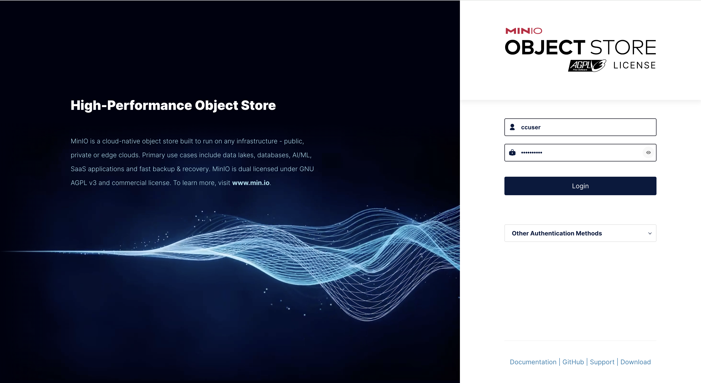
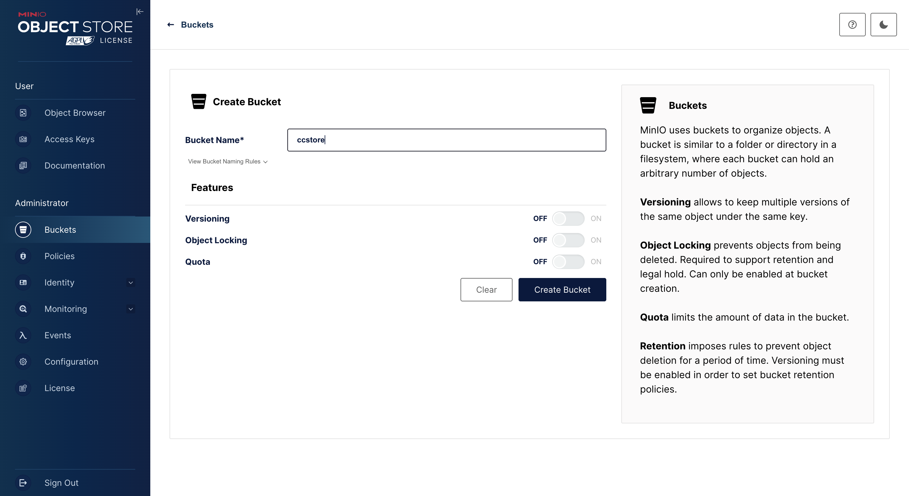
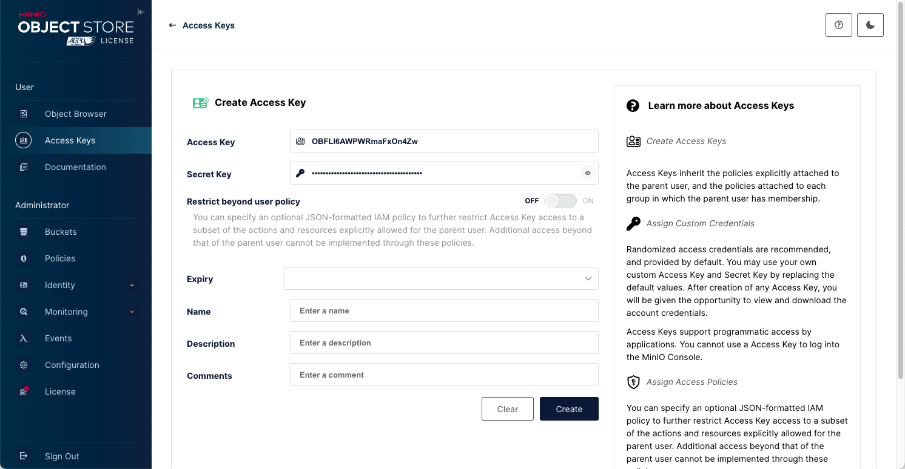
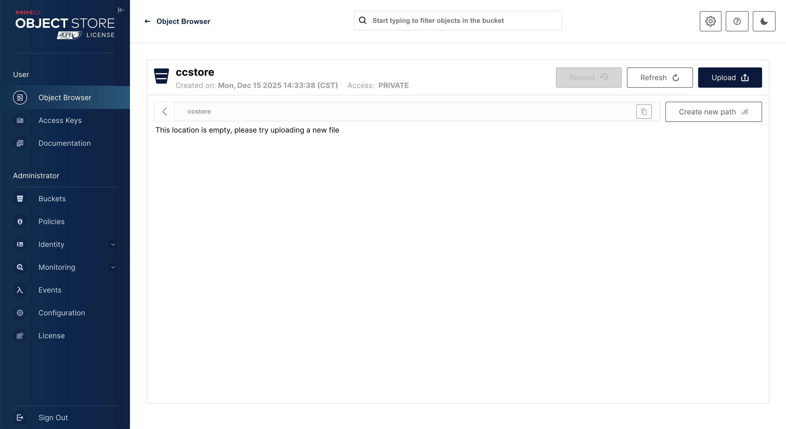

# Setting up Local Docker Compute Environment

A good way to test plugins and event configurations is to set up and use a local Docker-based compute environment. You can do everything on your local machine that you would be able to do in the cloud, except you are constrained to the available compute resources you have and won't see the scaling you can achieve in the cloud.

## Docker Desktop

Unless you work on a Linux desktop operating system, you will need [Docker Desktop](https://www.docker.com/products/docker-desktop/). There are alternative local containerization solutions, but currently we only support Docker Desktop.

Follow the directions on the Docker Desktop website to download and install Docker Desktop. Once you complete the installation, check that the Docker engine is available and running by running the following command in your terminal:

```sh
docker --version
```

That should result in something like:

```sh
Docker version 29.0.1, build eedd969
```

## Local Compute Environment

A CC Compute Environment needs 3 things:

- [x] A Docker container runtime such as Docker Desktop
- [ ] An object store
- [ ] An orchestration layer

In the AWS cloud, S3 is our object store solution, on the local desktop we recommend Minio. Unfortunately, the company behind Minio has begun locking down several important features in the open-source version of the app. We recommend using the specific version:

```
minio/minio@sha256:a929054ae025fa7997857cd0e2a2e3029238e31ad89877326dc032f4c1a14259
```

We are evaluating alternatives that will allow local deployments to keep up to date.

### Docker Compose

Docker comes with a utility called [Docker Compose](https://docs.docker.com/compose/) which makes it easy to define multi-container applications in a single yml file and start/stop services with simple commands. You can do the same thing using the docker daemon directly, but we don't recommend it.

Compose uses a `docker-compose.yml` file to describe the configuration. To run our object store, you can use the following `docker-compose.yml` file:

```yml
version: "3.6"
services:
  s3:
    image: minio/minio@sha256:a929054ae025fa7997857cd0e2a2e3029238e31ad89877326dc032f4c1a14259
    ports:
      - "9000:9000"
      - "9001:9001"
    volumes:
      - ./data/s3:/data
    environment:
      MINIO_ROOT_USER: ccuser
      MINIO_ROOT_PASSWORD: ************* <use a secure password>
      MINIO_OPTS: "--console-address :9001"
    command: ["server", "/data", "--console-address", ":9001"]
```

This will pull the specific version of the Minio image, set some environment variables and create and mount a local folder to store the data from the object store. That way the container can be stopped and re-started without losing any state.

> Change the password in the configuration prior to launch

Save the file above. To start the service, `cd` into the folder containing the `docker-compose.yml` file and run:

```sh
docker compose up
```

Check that Minio is working by navigating to `localhost:9001` in your browser. You should be able to log in using the credentials specified in the compose file.



### CC Store Bucket

A Bucket in an object storage environment is essentially a top-level container. CC requires a bucket to store payloads that running jobs can pull and use to define their operation.

Select "Buckets" from the "Administrator" panel menu group and click the "Create Bucket" button., you can call it whatever you want, but for this example, and in all the tutorials, we'll use `ccstore`.



### Access Keys

In order for CC to interact with the bucket we'll need to provide access keys to the CLI tool.

Select "Access Keys" from the "User" panel menu group and click the "Create access key" button.

Name the key however you like and this will be the ID/Secret key used by your compute environment file.



For this example, and access key id of `OBFLI6AWPWRmaFxOn4Zw` was created with a corresponding secret of `B5Mjn5FtekP6wwBGNecnVejgyG0c9jiaGAjshNui`

### CC Root Path

CC requires a root "folder", "prefix" or "path" used to manage payloads and other information that is transmitted to running jobs.

Select "Object Browser" from the User panel menu group, then select `ccstore` to view the objects in the store (which is currently empty).



Select the "Create new path" button to the right and create a path called `cc_store`. You can use whatever name you like but `cc_store` is the convention typically used and will match the prefix used in AWS.

### CC Env File

The best way to pass configuration information to the CC CLI at runtime is to specify a `.env` file. You can set up multiple `.env` files containing configuration information for local compute and for cloud-based compute respectively.

Create a file called `.env-local`.

It should look something like this, replace the access keys to match the ones you created earlier:

```
CC_AWS_ACCESS_KEY_ID=OBFLI6AWPWRmaFxOn4Zw
CC_AWS_SECRET_ACCESS_KEY=B5Mjn5FtekP6wwBGNecnVejgyG0c9jiaGAjshNui
CC_AWS_DEFAULT_REGION=us-east-1
CC_AWS_S3_BUCKET=ccstore
CC_AWS_ENDPOINT=http://localhost:9000
```

Note the `CC_` namespace used for the environment variables, this is an important convention used to designate keys to be used for the Cloud Compute store proper. When configuring access to other stores such as a S3 bucket, a namespace corresponding to the store name is used in the environment variables. This will make more sense when we talk about setting up stores in the [compute manifest section](./05_compute-manifests.md).

[**Next Step - Download and test the CC CLI**](./03_cc-cli.md)
